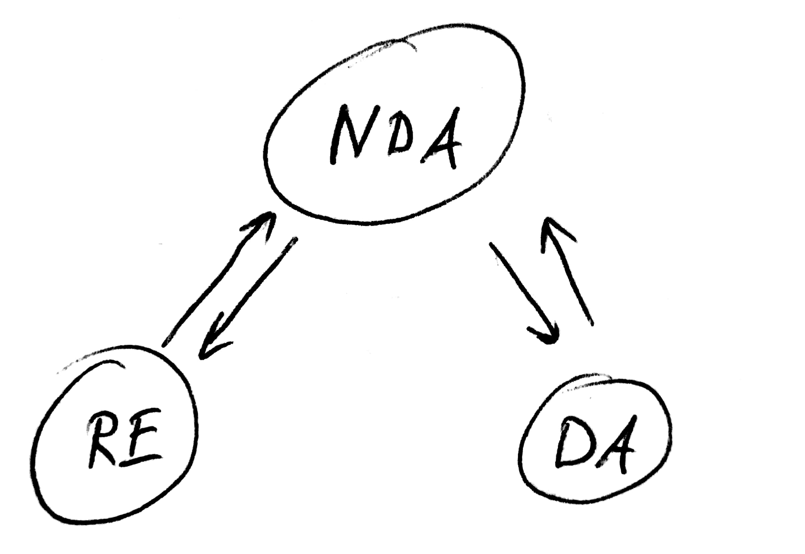
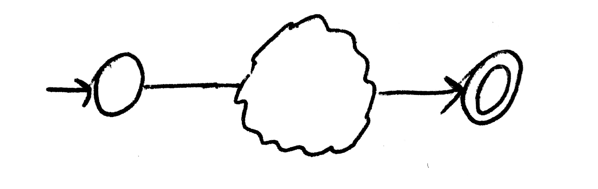
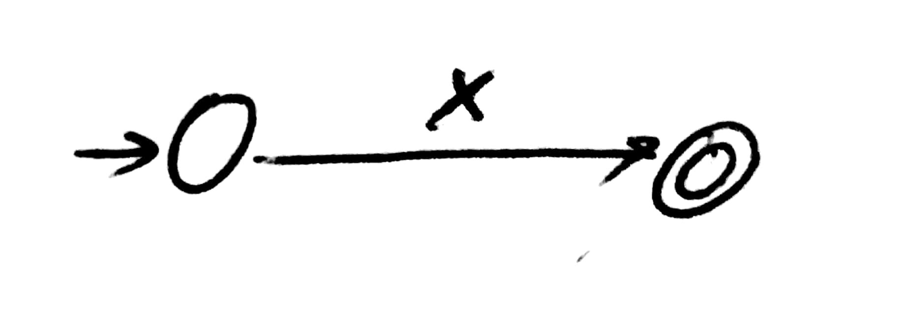
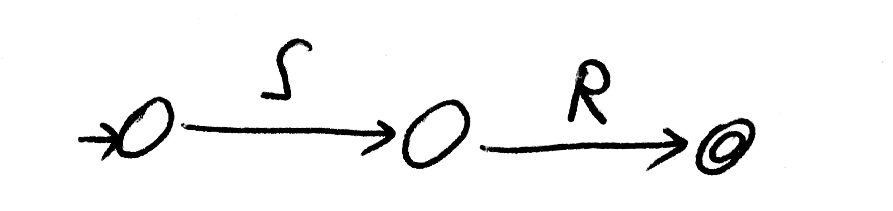
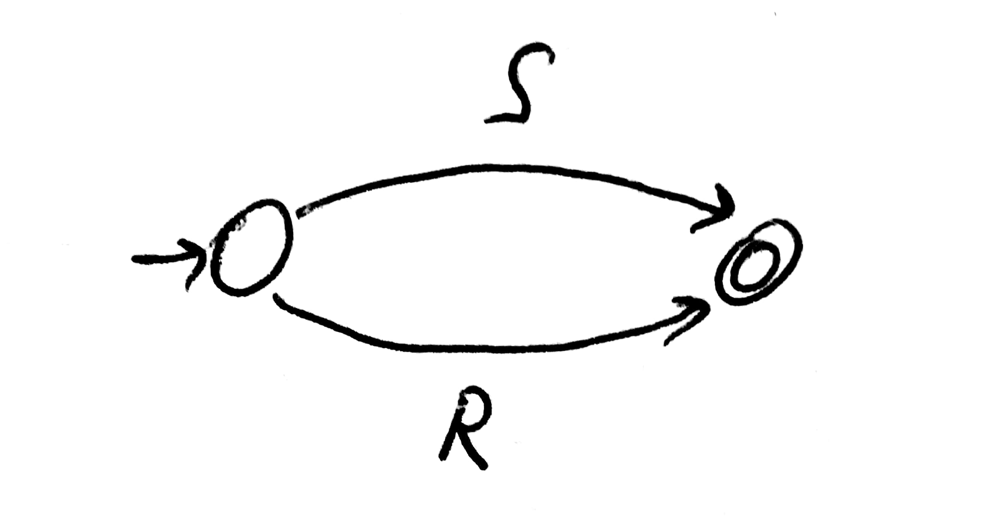
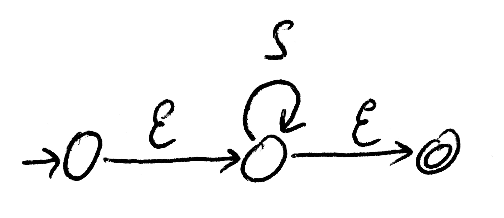
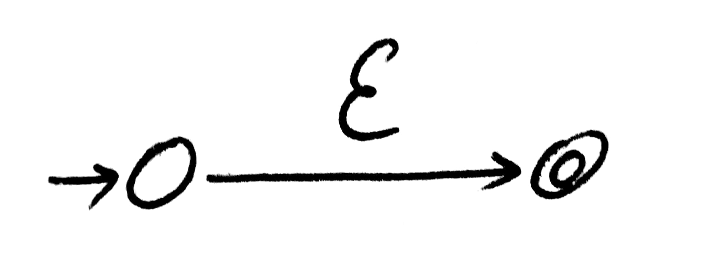

# Algoritmus

Program se vlastně skládá z několika převaděčů mezi jednotlivými typy entit.

Entity jsou 3, převodů by tedy mělo být 6, ale můžeme ušetřit - není třeba
psát převaděč `DA -> NDA` protože deterministický automat je vlastně
speciálním případem nedeterministického (implicitní převod). Dále je zbytečné
umět převod `RE -> DA`, když stačí zřetězit převody `RE -> NDA -> DA`.
Podobným způsobem můžeme dorazit na pouze 3 potřebné
přechody (a jeden implicitní):

Převody `RE <-> NDA` se k sobě navíc hodí, protože epsilonové hrany se
velmi snadno převádí na epsilonové výrazy a naopak.

Program tedy provede potřebné převody po sobě tak, aby se dostal z počátečního
uzlu v diagramu výše do cílového.

Převod `DA -> NDA` zde popisovat nebudu, protože se ani o převod defakto nejedná.

> Pozn: Při vymýšlení implementace algoritmu jsem uvažoval i jak jednotlivé
entity reprezentovat v paměti, aby se převod zbytečně nekomplikoval.
Reprezentace je popsaná na stránce [výrazů](regular-expression.md)
a [automatů](automaton.md).

## Regulérní výraz na nedeterministický automat

Nedeterministický automat bude mít jeden počáteční a jeden koncový stav. A mezi
nimi se vytvoří přechody a stavy, které budou reprezentovat výraz.

Tedy uvažujme nějakou funkci, která dostane odkaz na počáteční a koncový
stav a nějaký regulární výraz a vytvoří mezi zadanými stavy
odpovídající automat.

Taková funkce má zřejmě rekurzivní charakter, který vyplývá z rekurzivní povahy
regulárních výrazů.

Tedy stačí nám vymyslet, jak reprezentovat elementární operátory regulárního
výrazu a pomocí rekurze můžeme zkonstruovat libovolný výraz.

### Symbol

Symbol v automatu je reprezentován přechodem pro daný symbol.

### Konkatenace

Konkatenace dvou výrazů `R` a `S` znamená, že nejprve musí proběhnout první
výraz a dostat se do stavu někde "na půl cesty" a poté proběhnout druhý výraz.

Tedy bude potřeba přidat do automatu jeden nový stav.

### Alternace

Alternace znamená mít možnost jít buď jednou, nebo druhou cestou. Tedy
vzniknou nám mezi počátečním a koncovým stavem dvě paralelní větve automatu.

Zde se nám hodí to, že automat je nedeterministický, takže při jeho průchodu
se vybere ta "příznivá" cesta vedoucí k cíli.

### Kleeneho hvězda

Když je automat v nějakém stavu, tak kleeneho hvězda by znamenala udělat
přechod z tohoto stavu do něho samotného (udělat smyčku). Jenže my nevíme,
jestli počáteční a koncový stav nám zadaný je jeden a ten samý (dokonce na
začátku určitě není). Tedy opět se nám hodí to, že automat je nedeterministický
a můžeme použít epsilon přechody.

### Epsilon

Epsilonový výraz vypadá stejně jako běžný symbol. Dokonce má stejnou
implementaci (epsilon je jen speciálním symbolem).

## Nedeterministický automat na regulární výraz

Nejprve potřebujeme, aby měl automat pouze jeden počáteční a jeden koncový stav.
Tedy je přidáme. Počátečnímu stavu dáme epsilon přechody do všech předešlých
počátečních a všem předešlým koncovým dáme epsilonový přechod do nového koncového.

Dále změníme všechny přechody z klasických (symbol/epsilon) na přechody podle
regulárního výrazu. Převod není nijak složitý, jde spíš jen o přetypování přechodů,
než o nějakou chytrou logiku.

Nyní budeme postupně iterovat přes všechny původní stavy a budeme je odstraňovat
následujícím způsobem:

1) vezmeme všechny smyčky (přechody ze stavu do něho samého), spojíme je alternací
do jednoho výrazu a uložíme si ho bokem
2) iterujeme přes všechny dvojice "vstupní - výstupní" hrana stavu a nahradíme je
novou hranou, která vede přímo (bez našeho stavu) a její regulární výraz bude
konkatenací výrazů obou hran s vloženou kleeneho hvězdou mezi nimi (pokud existovala smyčka).
3) kdykoliv někde vedou dvě hrany paralelně, spojíme je do jedné pomocí alternace

Tímto postupem odstraníme všechny stavy až na ty dva přidané - počáteční a koncový.
Mezi nimi povede jediná hrana s výsledným regulérním výrazem.

> Pokud mezi nimi hrana nepovede, nebo povede v opačném směru, příjmá
automat prázdný jazyk

### Odstranění přebytečných epsilonů

Přidáním počátečního a koncového stavu jsme přidali potenciálně spoustu
epsilonových přechodů. Stejně tak automat může obsahovat epsilonové přechody.
Jejich přítomnost ve výrazu nevadí, ale je často zbytečná.

Některé epsilonové přechody můžeme odstranit procházením stromu výrazu a
nahrazováním následujících případů:

    epsilon . R   -->   R
    R . epsilon   -->   R
    epsilon*      -->   epsilon

> Proces zajišťuje procedura `RegularExpression.removeUselessEpsilons`

## Nedeterministický automat na deterministický

Převod lze dělat tak, že každý stav `DA` bude reprezentovat množinu stavů `NDA`.
Nebudeme uvažovat všechny množiny, to by bylo `2^|V(NDA)|` stavů `DA` a to je
zbytečně mnoho. Množiny budeme postupně přidávat, jak bude třeba.

Budeme tedy tvořit jakousi tabulku, která bude popisovat, pro danou množinu
stavů, na jakou množinu se přemění pro daný symbol.

Výsledná množina přechodu obsahuje všechny stavy, na které se pro daný
symbol dá dostat z alespoň nějakého stavu výchozí množiny.

Po určení každé množiny se k ní ještě přidají stavy, které leží za
epsilon přechodem - tím bude úplná.

> Epsilon přechod se v tomto případě neuvažuje jako symbol, chová se jinak

Počáteční množina stavů je - množina všech počátečních stavů `NDA`.

Množina bude reprezentovat koncový stav, pokud alespoň jeden z jejích
stavů je koncový. (to odpovídá představě `NDA`, že řetězec příjmá, pokud
existuje alespoň nějaká cesta)

Nakonec se podle tabulky vytvoří deterministický automat.